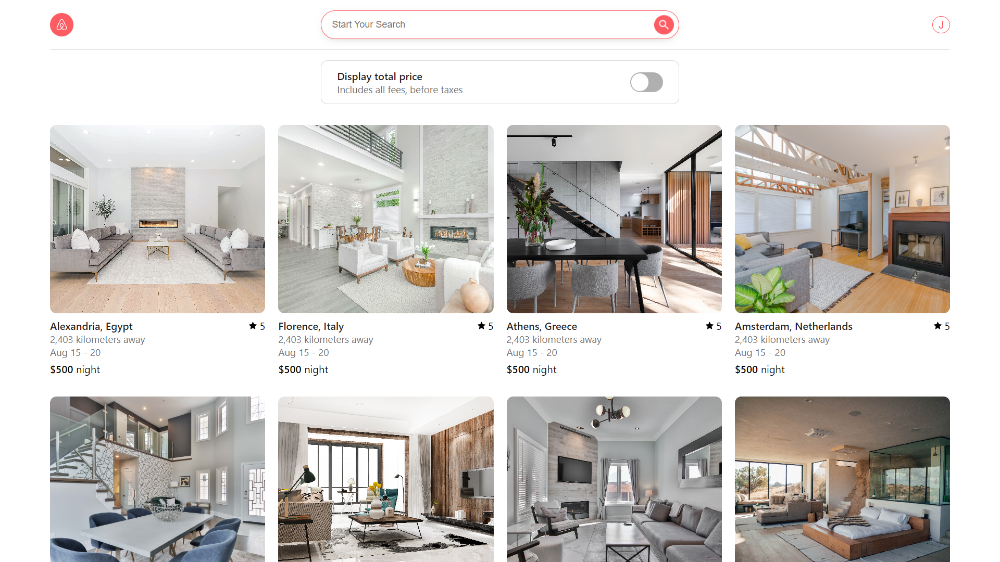

# Jobnb - House Listing and Renting Site

Welcome to Jobnb, simple house listing and renting platform that makes finding the perfect place to live easier than ever. This project leverages the power of React for the frontend and Node.js for the backend server to provide users with an intuitive and seamless experience when searching for, listing, and renting houses.

## Table of Contents

- [Introduction](#introduction)
- [Features](#features)
- [Getting Started](#getting-started)
  - [Prerequisites](#prerequisites)
  - [Installation](#installation)
- [Usage](#usage)
- [Technologies Used](#technologies-used)
- [Contributing](#contributing)
- [License](#license)

## Introduction

Jobnb is a web-based platform designed to simplify the process of finding, listing, and renting houses. With a user-friendly interface and robust backend, users can easily search for available properties, list their own properties for rent, and manage their renting experience. The platform also includes authentication mechanisms to ensure user data security and privacy.

## Features
**The Jobnb website is still under development so the features list will increase with time**

- **User Authentication**: Secure user registration and login functionality.
- **House Listings**: Browse through a wide range of available houses for rent.
- **Property Listing**: Property owners can list their houses for rent, providing detailed information and images.
<!-- - **Search Filters**: Users can refine their search results using various filters like location, price range, and property type. -->
<!-- - **User Profiles**: Users can manage their profiles and keep track of their listed properties and renting history. -->
<!-- - **Booking and Renting**: Seamless booking process for renting a property, with communication between property owners and renters. -->
<!-- - **User Reviews and Ratings**: Leave reviews and ratings for properties based on the renting experience. -->

## Getting Started

Follow these instructions to get a local copy of the project up and running on your machine.

### Prerequisites

- Node.js and npm (Node Package Manager) need to be installed on your system.

### Installation

1. Clone the repository (Client): `git clone https://github.com/JuszJo/air-bnb-clone-client-.git`
2. Clone the repository (Server): `git clone https://github.com/JuszJo/air-bnb-clone-server.git`
3. Navigate to the project directory
4. Install frontend dependencies: `cd air-bnb-clone-client- && npm install`
5. Install backend dependencies: `cd air-bnb-clone-server && npm install`
6. Create a `.env` file in the `server` directory and set up environment variables like database connection.

## Usage

1. Start the backend server: In the `server` directory, run `npm start`.
2. Start the frontend development server: In the `client` directory, run `npm start`.
3. Access the application by opening your browser and navigating to `http://localhost:3000`.

## Technologies Used

- **Frontend**: React, HTML, CSS
- **Backend**: Node.js, Express.js
- **Database**: MongoDB
- **Authentication**: JSON Web Tokens (JWT)
- **HTTP Requests**: Fetch

## Contributing

Contributions are welcome! If you'd like to contribute to the project, please follow these steps:
1. Fork the repository.
2. Create a new branch for your feature: `git checkout -b feature-name`
3. Make your changes and commit them: `git commit -m "Add feature"`
4. Push to the branch: `git push origin feature-name`
5. Submit a pull request detailing your changes.

## License

This project is licensed under the [MIT License](LICENSE).

---

Happy house hunting with Jobnb! If you have any questions or feedback, please don't hesitate to contact us.